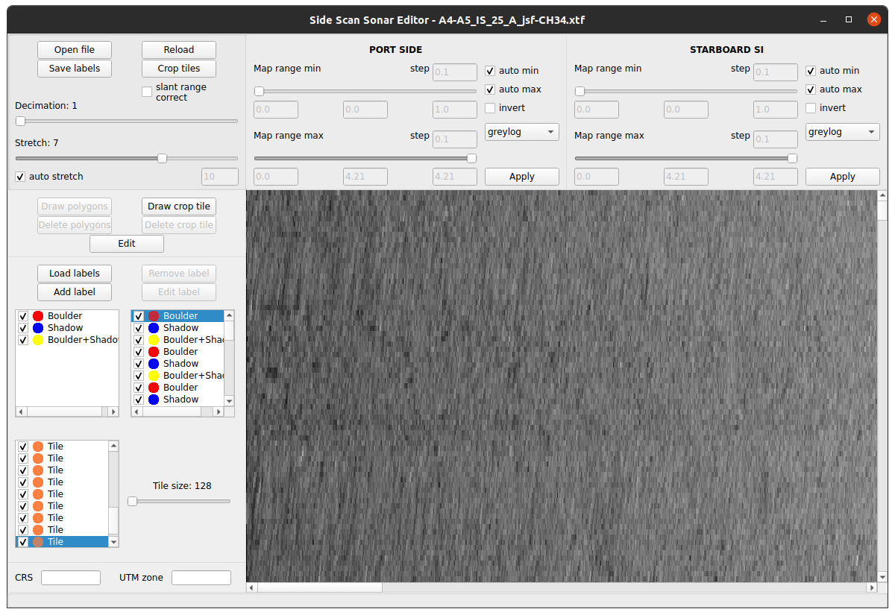
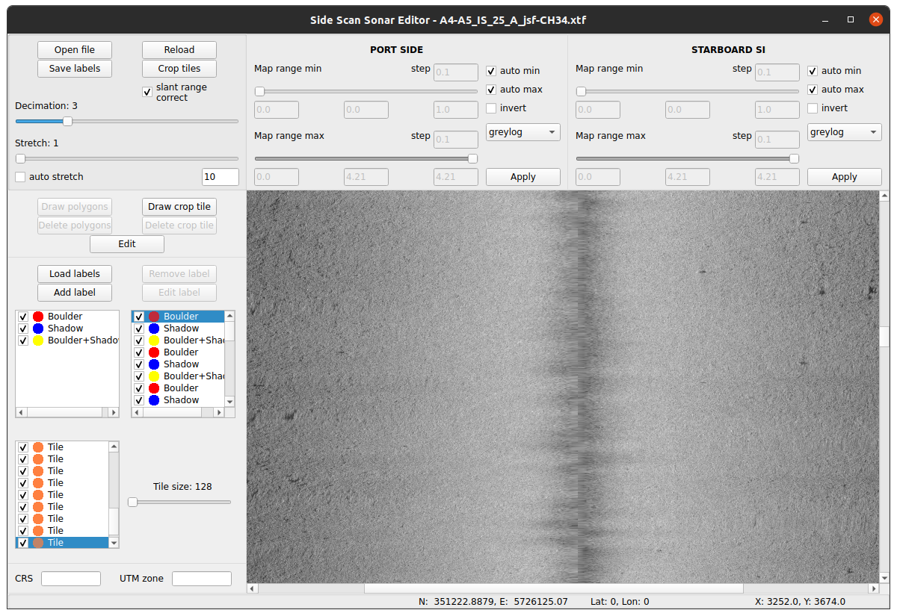
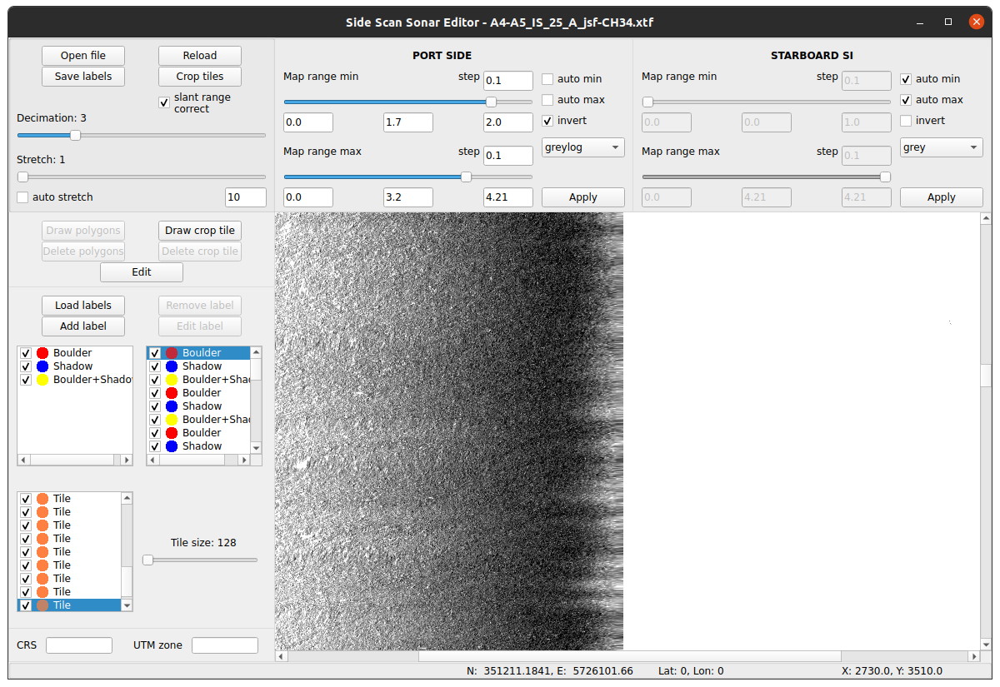
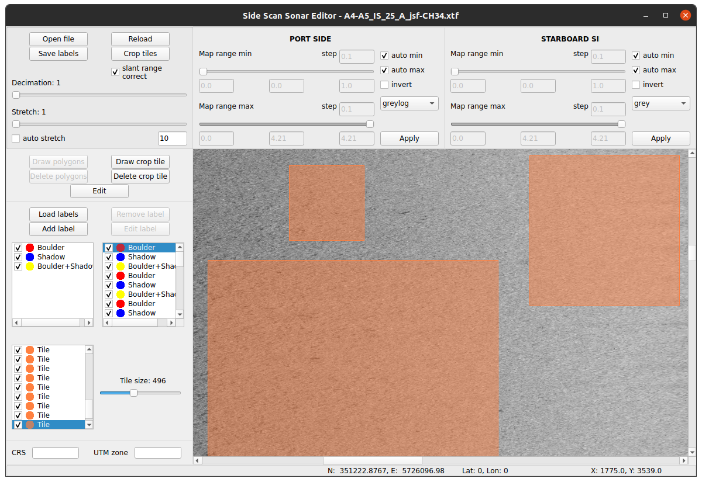
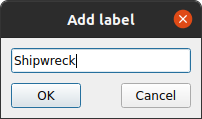
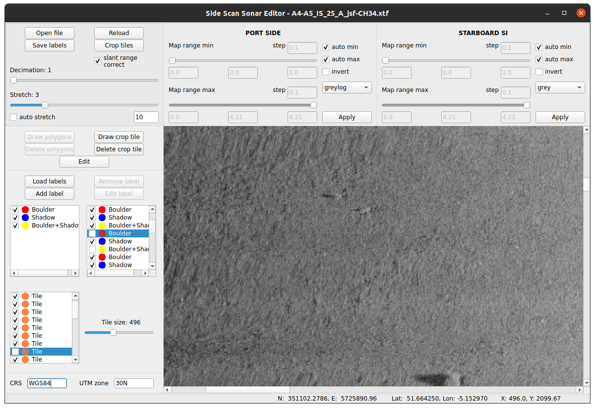

[](https://badge.fury.io/py/SideScanSonarEditor)[](https://doi.org/10.5281/zenodo.14928907)

# SideScanSonarEditor
SideScanSonarEditor is an open-source application designed for annotation of side-scan sonar data.

## Install and Requirements
The SideScanSonarEditor tool has been built and tested using Python 3.9 and requires following dependencies:
- [NumPy](https://numpy.org/)
- [opencv-python](https://opencv.org/)
- [Pillow](https://pillow.readthedocs.io/)
- [pyproj](https://pyproj4.github.io/pyproj)
- [PyQt6](https://www.riverbankcomputing.com/)
- [pyxtf](https://github.com/oysstu/pyxtf)
- [SciPy](https://scipy.org/)

To install through PyPI: 
```python 
pip install SideScanSonarEditor
```

Or to install from source:
1. Clone the repository from GitHub:

    ```bash
    git clone https://github.com/MichalMotylinski/SideScanSonarEditor.git
    ```

2. `SideScanSonarEditor` can then be installed using pip.
    From top-level directory run:

    ```python
    pip install .
    ```

    to install dependencies listed in requirements.txt to your local python library.


## Usage
-------------
After installation he app can be launched with:
1. Console command:
    ```bash
    SideScanSonarEditor
    ```
2. Import and run it from a Python script:
   ```python
    from SideScanSonarEditor import app
    app.main()
    ```

The `SideScanSonarEditor` was designed to read side-scan sonar data from XTF files and does not support any other input format or other sonar data.



### Loading data and sonar image generation
Use "Open file" button to select and load XTF file. The app will automatically display the sonar image with default settings if no changes were made.
The "Reload" button can be used to quickly reload the selected XTF file. It's primary use is to allow quick loading with new sonar data processing settings (Decimation, Stretch, Slant range correction)

The top left corner toolbox contains parameters used for initial processing of the data not sonar image. These changes are applied directly to raw data after loading from XTF file.
Decimation - across track down sampling with 1-10 range where each level halves the number of horizontally processed data points.
Stretch - Along track stretch factor which defines how many times each ping should be repeated. This method is applied to improve the visual representation of the features. The stretch factor by default is set to auto but it can be addjusted manually. The maximum slider value can be decreased or increased depending when needed.
Slant range correction - Applying correction shows more realistic representation of the seafloor without water column.



### Channel display settings
For each channel port and starboard there is a separate toolbox that allows changing of the color scheme, colour inversion as well as changing mapping ranges. Under each slider there is a minimum, current and maximum value to modify the slider itself. The step controls how much the current value changes across the selected range. Choosing very small step or large range may lead to skipping in the values so it is always adviced to keep the range of slider values below 300.



### Drawing shapes
The tiles can be drawn without any object classes and exported for further processing but to draw the polygons at least one label must exist in the list of labels (upper left list). The labels can be loaded from a text file where each label has to be listed in a separate line for example:
Boulder
Debris
Shipwreck
...



User can also add new labels manually with "Add label" button.
The labels can be modified or removed using "Edit label" and "Remove label" accordingly.


The upper right list shows a list of drawn polygons and their classes. The checkbox can be used to hide or show a specific shape.
To hide/show all shapes from the same class user can you checkboxes next to class names in upper left list.

The lower left list shows drawn tiles which can also be shown or hidden. The slider next to the list allows to modify the size of the tile before drawing.

The user can choose to display longitude and latitude of the current mouse position by supplying UTM zone number and ellipsoid model used. The function only accepts UTM projection type.




Finally user can save currently drawn shapes by clicking "Save labels". This creates 2 separate files holding polygons and tiles for the use by the app. These shapes are always loaded by the app if present in the same directory as XTF file. 
The "Crop tiles" button allows user to create a annotations file in a COCO format. Each image entry has additional key "side" which indicates from which channel the image was cropped. This might be helpful if user would like to perform further processing with the original XTF file using cropped coordinates. The remaining outlook of the file is unchanged and can be used directly for computer vision tasks.


## Author Contributions

- **Michal Motylinski**: Software development, Design, Writing – Original Draft.
- **Prof. Andrew J. Plater**: Supervision, Conceptualization, Writing – Review & Editing.
- **Dr. Jonathan E. Higham**: Supervision, Conceptualization, Writing – Review & Editing.

License
-------
This project is licensed under the [GNU License](./LICENSE).
