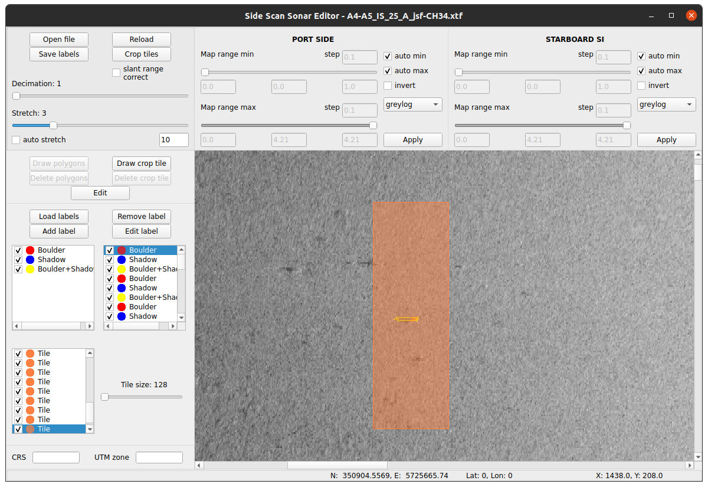

# Summary

Side-scan sonars are commonly used devices for mapping of the seafloor.
The collected data allows for the generation of detailed imagery of the surveyed area (Chang et al., 2010).
The typical use cases of side-scan sonar include:
 - Marine archeology
 - Underwater topography
 - Underwater security
 - Resource exploration
Annotation of the targets is typically done using specialised software which does not produce results allowing for quick conversion to formats commonly used to train machine learning models.
`SideScanSonarEditor` is a free and open-source Python package which allows the user to read sonar data from XTF files, display it as images and allow further processing (XTF FILE FORMAT, n.d.).
The key actions avaialable include analysis of the sonar imager, simple manipulation of the sonar imagery and annotation of the objects of interest.
The tool allows for drawing of polygon shapes as well as rectangular shapes which coordinates are used to crop smaller image tiles. Together they can be used in the process of dataset creation for further sonar analysis or computer vision tasks such as object detection or segmentation.
(\autoref{fig:overview}).

`SideScanSonarEditor` provides the following sonar image manipulation methods:
 - Decimation – across-track down sampling which might be useful when importing very large files that might exceed memory limits on some systems. The decimation factor directly determines the fraction of the data that is to be retained meaning with a factor of 1, 100% of the samples are loaded, with a factor of 2, 50%, factor of 3, 33% and so on. The setting range goes from 1-10 but in reality, values greater than 4 will produce errors or severely reduce the number of samples leading to the loss of a significant portion of data. For the purpose of this research, decimation is set to 1 at all times to ensure the highest number of horizontal features per target.
 - Stretch – Along-track stretch factor which defines how many times each ping should be repeated. This method is applied to improve the visual representation of the features. Typically, when the data is displayed, the objects will appear stretched horizontally and compressed vertically. To compensate without losing across-track features the image is expanded vertically allowing for easier analysis and labelling of the targets. The stretching method, however, is not utilised when generating training data or during inference. The technique is used purely as a visual correction during the annotation process.
 - Invert – Inversion of the colour palette which in some cases might help in visual recognition of targets.
 - Colour mapping – Setting colour palette to highlight different features. Applying different mapping scales can help distinguish various targets on the image. Currently available options include two greyscale patterns a linear (grey) and logarithmic (greylog).
 - Map range – Minimum and maximum mapping ranges are by default automatically calculated based on the intensity input data. Both can be manually modified to change the representation of the features for easier interpretation.
 - Slant range correction - apply slant rage correction to compensate for the geometric distortion of the return signal. The corrected image represents true seafloor distances allowing for better alignment with the navigation data (Chang et al., 2010).

# Statement of Need

The interpretation of the sonar data is typically conducted using proprietary software specifically designed to analyse such data and provide extensive post-processing capabilities. These software packages however do not allow for extraction of the imagery and annotations in a format allowing easy training of computer vision models or processing. For the purpose of training the automatic target recognition model, the imagery has to be manually cropped in SonarWiz (or other closed-source software) to then be annotated using LabelMe or other standard annotating tools (Wada, 2024). This process took a very long time because it required visual analysis of the sonar swaths in SonarWiz or EdgeTech Discover and assigning areas meant for cropping (Chesapeake Technology - Makers of SonarWiz, n.d.),(EdgeTech, n.d.). After the cropping process was completed, the images had to be analysed again this time in LabelMe specifically with the purpose of labelling. The other way to obtain imagery is to take screenshots of the sonar swaths while displaying them in one of the mentioned closed-source software solutions which some researchers do. We are not aware of any other open-source solution allowing us to view, manipulate and annotate side-scan sonar files thus this piece of software can be of great use to anyone working with sonar data or imagery. SideScanSonarEditor significantly simplifies and speeds up the process of annotating sonar data and the output format allows for very easy analysis, further processing or training object detection or segmentation models. SideScanSonarEditor using the pyxtf library reads the entire XTF file and generates a waterfall view of the surveyed area (Sture, 2016/2025). The data is displayed as a collection of pings with the direction of the scan being from bottom to the top. The image view consists of two parts: the port side and the starboard side, with port side data being horizontally flipped for real-world representation of the seafloor. The primary function is to generate waterfall images and allow for annotation of the targets as well as cropping tiles with them creating a dataset ready for model training. The software allows for the creation, edition and removal of class labels and drawing polygons around objects of interest. The unlimited zoom allows for very close inspection of the area and precise labelling which is crucial considering that the research is focused on the detection of very small objects like boulders. Furthermore, a tile cropping ability was added allowing the selection of exact areas for extraction in the form of rectangular tiles. Initial attempts in automatic cropping resulted in duplicates or incomplete object cropping potentially having a negative impact on the trained model, thus it was decided that manual drawing of crop tiles would provide the best results. Each channel (port side, starboard side) can be separately modified by using a set of simple tools to change the appearance of the visualisation. The user can choose to invert the colour mapping and normalise the intensity of the pixels to highlight different features. The resulting annotations are saved in a commonly used COCO format which allows direct training without any additional processing or conversion (Lin et al., 2014).

# Future Work

The side-scan sonar data can be saved in numerous different formats (XTF, JSF, GCF and more). In the future support for more formats may be added.
Additional sonar data correction and image manipulation functions may be added in the future including bottom tracking or colour palette change.
In current form the tool is very simple but future version might see an improved drawing methods and more predefined shapes.
More output formats may be added in the future including PASCAL VOC and YOLO.

# Acknowledgements

This work was supported by the Port City Innovation Hub (European Regional Development Fund).

# References
Chang, Y.-C., Hsu, S.-K., & Tsai, C.-H. (2010). SIDESCAN SONAR IMAGE PROCESSING:CORRECTING BRIGHTNESS VARIATION AND PATCHING GAPS. Journal of Marine Science and Technology, 18(6). https://doi.org/10.51400/2709-6998.1935
Chesapeake Technology - Makers of SonarWiz. (n.d.). Retrieved December 6, 2024, from https://chesapeaketech.com/
EdgeTech. (n.d.). Retrieved December 6, 2024, from https://www.edgetech.com/
Lin, T.-Y., Maire, M., Belongie, S., Hays, J., Perona, P., Ramanan, D., Dollár, P., & Zitnick, C. L. (2014). Microsoft COCO: Common Objects in Context. In D. Fleet, T. Pajdla, B. Schiele, & T. Tuytelaars (Eds.), Computer Vision – ECCV 2014 (pp. 740–755). Springer International Publishing. https://doi.org/10.1007/978-3-319-10602-1_48
Sture, Ø. (2025). oysstu/pyxtf. https://github.com/oysstu/pyxtf (Original work published 2016)
Wada, K. (2024). Labelme: Image Polygonal Annotation with Python. https://doi.org/10.5281/zenodo.5711226
XTF FILE FORMAT. (n.d.). Retrieved May 2, 2023, from https://www.ecagroup.com/en/xtf-file-format

  

\pagebreak
\appendix

